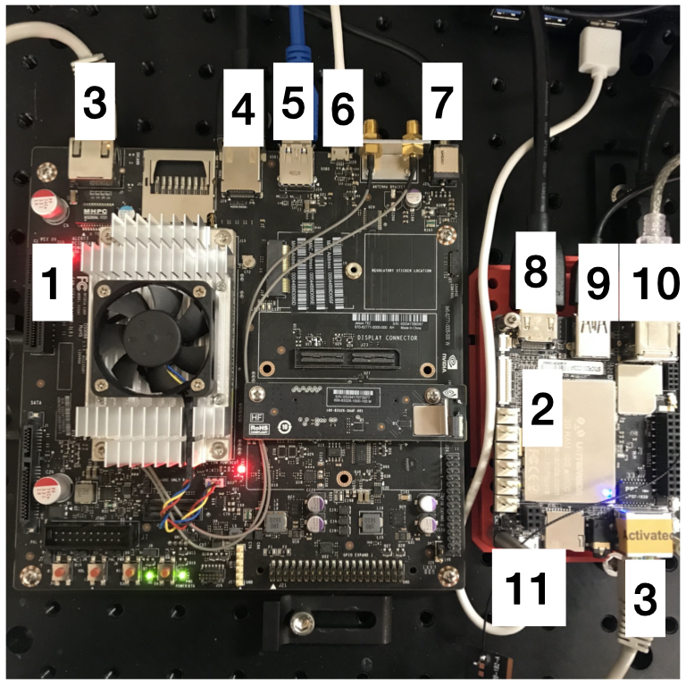

# Development board setup.

1. Jetson Nvidia TX2 Development board.
2. LattePanda Development Board.
3. Ethernet cable (LattePanda to Jetson).
4. HDMI cable to monitor and augmented reality display.
5. USB3.0 -> Photometrics Prime sCMOS
6. microUSB to USB
7. Power supply.

